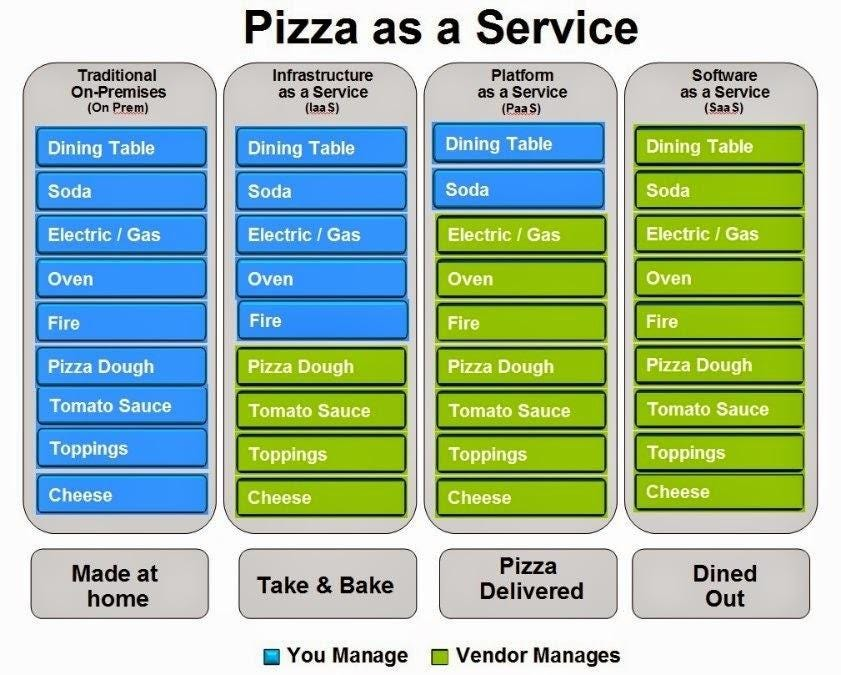

# PL-600-Guide

## Links of interest
- [Trust Center](https://www.microsoft.com/en-us/trust-center)
- [Cross-region replication](https://learn.microsoft.com/en-us/azure/reliability/cross-region-replication-azure)
- [Best practices and guidance for model-driven apps](https://learn.microsoft.com/en-gb/power-apps/developer/model-driven-apps/best-practices/)
- [Appendix: App design best practices checklist](https://learn.microsoft.com/en-gb/power-platform/developer/appsource/appendix-app-design-best-practices-checklist)
- [Best practices for developing with Dynamics 365 Customer Engagement](https://learn.microsoft.com/en-gb/dynamics365/customerengagement/on-premises/developer/best-practices-sdk?view=op-9-1)
- [Enable the Power BI/Power Apps Solutions integration (preview)](https://learn.microsoft.com/en-gb/power-bi/collaborate-share/service-power-bi-powerapps-integration-enable)
- [Power Platform Landing Zones](https://github.com/microsoft/industry/tree/main/foundations/powerPlatform)
- [Creator kit](https://learn.microsoft.com/en-us/power-platform/guidance/creator-kit/overview)
- [Power Automate vs classic workflows](https://learn.microsoft.com/en-us/power-automate/replace-workflows-with-flows#feature-capability-comparison)
<!-- -  -->

## More certifications
- [Exam PL-500: Microsoft Power Automate RPA Developer](https://learn.microsoft.com/en-us/certifications/exams/pl-500/)
- [Exam PL-300: Microsoft Power BI Data Analyst](https://learn.microsoft.com/en-us/certifications/exams/pl-300/)
- [Exam AZ-305: Designing Microsoft Azure Infrastructure Solutions](https://learn.microsoft.com/en-us/certifications/exams/az-305/)
- [Exam AZ-400: Designing and Implementing Microsoft DevOps Solutions](https://learn.microsoft.com/en-us/certifications/exams/az-400/)
<!-- -  -->

## Quickstarts and Tutoriales
- [Create a custom connector from scratch](https://learn.microsoft.com/en-us/connectors/custom-connectors/define-blank)
- [Create and edit virtual tables that contain data from an external data source](https://learn.microsoft.com/en-gb/power-apps/maker/data-platform/create-edit-virtual-entities)
- [Create and use custom APIs
](https://learn.microsoft.com/en-gb/power-apps/developer/data-platform/custom-api)
- [Code Examples used by the Quickstarts in the Cognitive Services Documentation](https://learn.microsoft.com/en-us/samples/azure-samples/cognitive-services-quickstart-code/cognitive-services-quickstart-code/)
- [Code Examples used by the Quickstarts in the Cognitive Services Documentation (GITHUB)](https://github.com/Azure-Samples/cognitive-services-quickstart-code/tree/master)
<!-- -  -->

## Tools
- [Microsoft Datacenters](https://datacenters.microsoft.com/globe/explore?info=region_eastus)
- [Azure Services Overview](https://azurecharts.com/overview/?f=iaas)
- [Azure Latency Test](https://www.azurespeed.com/Azure/Latency)
- [Canvas Apps Components Samples](https://powerusers.microsoft.com/t5/Canvas-Apps-Components-Samples/bd-p/ComponentsGallery)
- [PCF Gallery](https://pcf.gallery/)
<!-- -  -->

## Labs & exercises
- [PL-500 LABS](https://microsoftlearning.github.io/PL-500T00-Microsoft-Power-Automate-RPA-Developer/)
- [PL-600 EXERCISES](https://microsoftlearning.github.io/PL-600-Microsoft-Power-Platform-Solution-Architect/)

## Visuals

**English:**

1.  **IaaS** (Infrastructure as a Service):
    *   **Azure Virtual Machines:** Provides virtualized computing infrastructure in the cloud, allowing users to run virtual machines with different operating systems and applications.

2.  **PaaS** (Platform as a Service):
    *   **Azure App Service:** A platform that enables developers to build, deploy, and scale web and mobile applications without having to manage the underlying infrastructure. It offers a managed runtime environment for various technologies and development frameworks.

3.  **SaaS** (Software as a Service):
    *   **Microsoft 365:** A suite of cloud-based services that includes popular applications like Word, Excel, PowerPoint, and Outlook, along with collaboration services like SharePoint and Teams. These applications and services run on Microsoft's infrastructure and are available to users through a Microsoft 365 subscription.

## Chatbot options

|                      | Azure Bot Framework                  | Azure Bot Composer                   | QnA Maker                             | Power Virtual Agents                 |
|----------------------|--------------------------------------|--------------------------------------|---------------------------------------|--------------------------------------|
| Description          | Comprehensive platform for developing custom bots using code. | Visual tool based on natural language for building bots without writing code. | Service for creating and managing question and answer knowledge bases for bots. | No-code tool for quickly and easily creating conversational bots. |
| Flexibility         | High                                 | Medium                                | Medium                                 | Low                                 |
| Logic Control    | High                                 | Medium                                | Low                                  | Low                                 |
| Programming Level| Requires programming knowledge | No programming required         | No programming required           | No programming required          |
| Visual Approach       | No                                   | Yes                                   | No                                    | Yes                                   |
| Channel Integration| Yes                                 | Yes                                   | Yes                                    | Yes                                   |
| AI Usage            | Yes                                   | Yes                                   | Yes                                    | Yes                                   |
| Customization      | High                                 | Medium                                | Low                                  | Low                                 |
| Development Speed| Medium                                | High                                 | High                                  | High                                 |
| Target Audience           | Developers                       | Developers and non-programming professionals | Developers and domain professionals | Business users and domain professionals |

## Contact

https://www.linkedin.com/in/jafet-zagal/