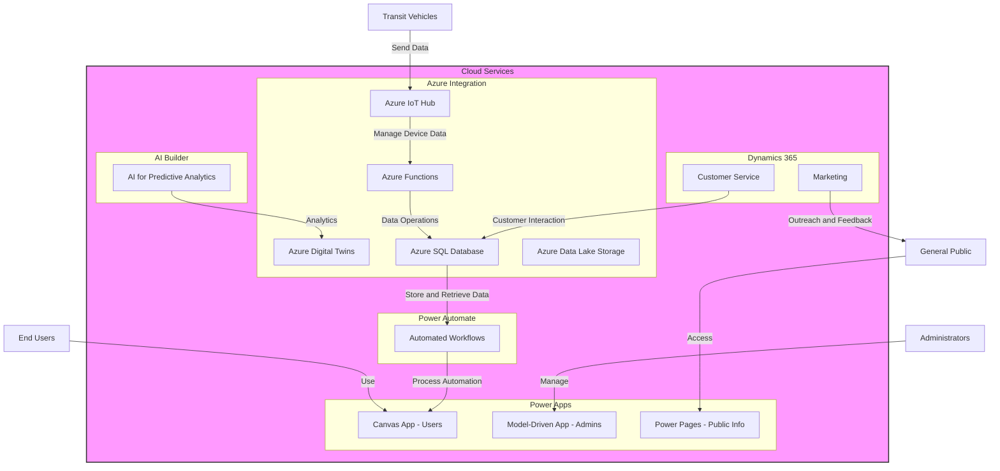
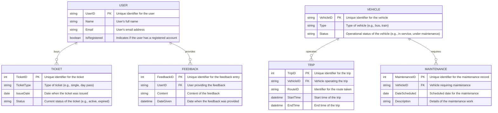

### 1. High-Level Architecture Diagram
This architecture integrates various Microsoft technologies to address the requirements of a scalable, secure, and user-friendly transit system.

### 2. Security Strategy

- **Role-Based Access Control (RBAC)**: Implement RBAC within Power Apps and Azure services to ensure that users can only access the data and functionality necessary for their roles.
- **Data Encryption**: Utilize Azure's built-in encryption capabilities to encrypt data at rest and in transit.
- **Compliance Audits**: Regularly conduct audits to ensure ongoing compliance with GDPR and other relevant regulations.
- **Secure APIs**: Use Azure API Management to secure and manage APIs used by Power Apps and external systems.

### 3. Performance Optimization Plan
Optimizing performance to handle the scale and demand of a city-wide transit system.

- **Load Testing**: Conduct regular load testing to identify potential bottlenecks and stress points in the system.
- **Data Caching**: Implement caching strategies using Azure Redis Cache to improve the responsiveness of the system.
- **Scalable Architecture**: Design the system using Azure Functions and Azure Logic Apps to automatically scale based on demand.

### 4. User Adoption Strategy
Maximizing user adoption through effective training and feedback mechanisms.

- **Interactive Training Sessions**: Develop interactive training sessions using Power Pages to educate users on system features.
- **Feedback Loop**: Integrate a feedback module within the Canvas App to collect and analyze user feedback for continuous improvement.
- **Multilingual Support**: Ensure the user interface is available in multiple languages to cater to all city residents.

### 5. Project Management Plan
Using Agile methodologies to manage the project efficiently.

- **Agile Sprints**: Break down the project into two-week sprints, with specific goals and deliverables for each sprint.
- **Roles and Responsibilities**: Clearly define roles and responsibilities for each team member, ensuring accountability.
- **Stakeholder Engagement**: Regularly update stakeholders on progress and incorporate their feedback into the project.

### 6. Functional Requirements

1. **Real-Time Vehicle Tracking**
   - System must track the location of all buses and trains in real time and provide this information to both the control center and public-facing apps.

2. **Unified Ticketing System**
   - Implement a unified ticketing system across all transport modes, allowing users to purchase and renew tickets via mobile and web applications.

3. **Automated Alerts for Maintenance**
   - The system should automatically generate maintenance alerts based on vehicle diagnostics and predictive analytics from AI Builder.

4. **Customer Feedback Integration**
   - Integrate a feedback mechanism within the mobile app to collect and analyze customer feedback in real time.

5. **Custom Reporting Tools**
   - Develop custom reporting tools for administrative use that allow for the analysis of operational efficiency, transit usage, and maintenance schedules.

6. **Marketing and Outreach Automation**
   - Automate marketing campaigns and outreach efforts through Dynamics 365, targeting promotions based on user behavior and preferences.

7. **Disaster Recovery Protocols**
   - Implement protocols for data backup and system recovery to ensure service continuity in the event of an outage or disaster.

### 7. Non-Functional Requirements

1. **Scalability**
   - The system must be capable of scaling to handle increases in user numbers and data volume without degradation in performance.

2. **Availability**
   - Achieve at least 99.9% uptime for all critical components of the system, ensuring consistent accessibility for users and administrators.

3. **Security**
   - Adhere to industry-standard security practices, including data encryption at rest and in transit, regular security audits, and compliance with GDPR and other privacy regulations.

4. **Usability**
   - The user interfaces, both mobile and web, should be intuitive and easy to use for all demographic groups, with support for multiple languages.

5. **Performance**
   - The system should provide responses within 2 seconds for user interactions under normal conditions and handle simultaneous connections of at least 10,000 users.

6. **Maintainability**
   - The system should be designed for easy maintenance and updates, with clear documentation and modular components.

7. **Integration Compatibility**
   - Ensure compatibility and easy integration with existing city infrastructure systems as well as potential future upgrades or systems from other vendors.

### 8. Fit-Gap Analysis

| Requirement                        | Current Capability                         | Gap Identified                            | Solution Proposal                          |
|------------------------------------|--------------------------------------------|-------------------------------------------|--------------------------------------------|
| **Real-Time Vehicle Tracking**     | Basic GPS tracking with delayed reporting  | No real-time data integration             | Implement Azure IoT Hub for real-time data processing and integration |
| **Unified Ticketing System**       | Physical tickets and basic mobile app      | Lack of integrated digital platform       | Develop a comprehensive Power App for ticket management across all transit modes |
| **Automated Alerts for Maintenance** | Manual scheduling based on fixed intervals | No predictive maintenance capabilities    | Use AI Builder for predictive analytics to automate maintenance alerts |
| **Customer Feedback Integration**  | Limited to post-trip surveys via email     | No real-time feedback collection          | Integrate real-time feedback mechanisms in the user app using Power Apps and Dynamics 365 |
| **Custom Reporting Tools**         | Reports generated manually on request      | Inefficiency and delay in report generation | Create automated reporting tools using Power BI integrated with Azure SQL Database |
| **Marketing and Outreach Automation** | Manual campaign management               | Lack of targeted and automated outreach   | Automate marketing using Dynamics 365 to analyze customer data and target communications |
| **Disaster Recovery Protocols**    | Basic backup procedures                    | Insufficient recovery measures for high availability | Develop robust disaster recovery strategies using Azure's backup and recovery solutions |
| **Scalability**                   | System struggles under high load           | Inability to scale during peak times      | Architect the solution using scalable Azure services like Azure Functions and Azure Logic Apps |
| **Availability**                  | Occasional downtimes affecting service     | Need for higher uptime to meet user expectations | Enhance availability with Azure's high-availability features and load balancing |
| **Security**                      | Basic security measures in place           | Compliance gaps with modern data protection laws | Implement comprehensive security measures including encryption, Azure Security Center, and regular audits |
| **Usability**                     | User interfaces are not intuitive          | Poor user experience leading to reduced usage | Redesign user interfaces focusing on usability, integrating feedback from user studies |
| **Performance**                   | Slow response times during peak usage      | Inadequate performance affects user satisfaction | Optimize performance through Azure's global infrastructure and caching mechanisms |
| **Maintainability**               | System components are highly customized    | Difficult to update and maintain          | Standardize components and use modular architecture for easier maintenance |
| **Integration Compatibility**     | Minimal integration with other city systems | Lack of interoperability with new and existing technologies | Ensure new solutions are built with open standards for easier integration |

### 9. Data Modeling

